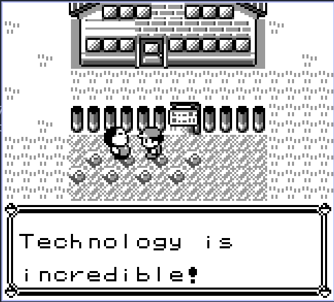

# Game Boy Color Emulator

It's been a while since I wanted to build a CGB emulator. It was a nice ride.
This CGB emulator is retro-compatible with DMG (different hardware is emulated depending on the cartridge header).
The accuracy of the emulator is not 100%, thus some games might crash.

## Pictures

Pokemon Crystal            |  The Legend of Zelda: The Oracle of Ages
:-------------------------:|:-------------------------:
  |  

Shantae                    | Pokemon Blue (DMG compatibility)
:-------------------------:|:-------------------------:
  |  


## How to compile

```bash
git clone https://github.com/pcineverdies/gameboy_emulator
cd gameboy_emulator
mkdir build
cd build
cmake .. [-DDEBUG=1] [-DPROFILE=1]
make
```

By adding the macro `DEBUG`, some debug information are displayed from the console.
By adding the macro `PROFILE`, the binary is compiled so that `gprof` can be used for profiling.

## How to use

```bash
./build/gameboy --rom ./path/to/rom [--fixed_fps]
```

The argument `--rom path` is required for the emulator to run.

The argument `--fixed_fps` is optional, and fixes the fps to ~59.7.
This is done using audio synch, which means this is the only way to also enable audio in the emulator.

The argument `--help` shows an help message for usage.

During the game, the following keybiding is used

- `W` -> Up 
- `A` -> Left
- `S` -> Down
- `D` -> Right
- `J` -> A
- `K` -> B
- `B` -> Start
- `V` -> Select
- `Q` -> Quit emulator
- `P` -> Volume up
- `O` -> Volume down

The volume is on 11 levels (from 0% to 100%), the emulator starts with 100%.

## Resources

- [gbops, an accurate opcode table for the Game Boy](https://izik1.github.io/gbops/index.html);
- [The EmuDev subreddit](https://www.reddit.com/r/EmuDev/) and the discord server;
- [This DAA instruction write-up](https://ehaskins.com/2018-01-30%20Z80%20DAA/);
- [This HALT-bug write-up](https://github.com/nitro2k01/little-things-gb/tree/main/double-halt-cancel);
- [Gameboy-doctor](https://github.com/robert/gameboy-doctor), to run blargg tests before the display was active;
- [This timer write-up](https://github.com/Hacktix/GBEDG/blob/master/timers/index.md);
- [This PPU write-up](https://hacktix.github.io/GBEDG/ppu/);
- [This APU write-up](https://nightshade256.github.io/2021/03/27/gb-sound-emulation.html#fnref:2)

## What is currently missing

- The PPU is implemented using scan-line, which is fine for 99.99% of the games. A proper FIFO PPU should be implemented to increase overall accuracy of the system.
- The APU works while not passing the relative blargg tests. As the APU has many corner cases to be handled, this would require a bit of work.
- Not all the MBCs are implemented (only NO-ROM, 1, 3 and 5).
- Some general emulator capabilities (which are console-agnostic) are missing: there is no save state and no rewind.
